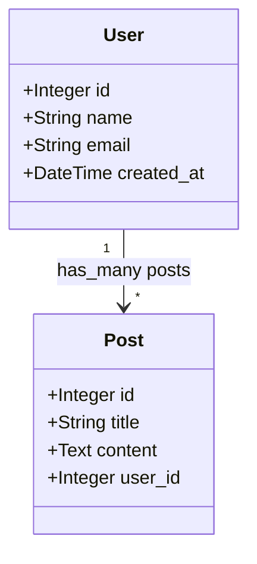
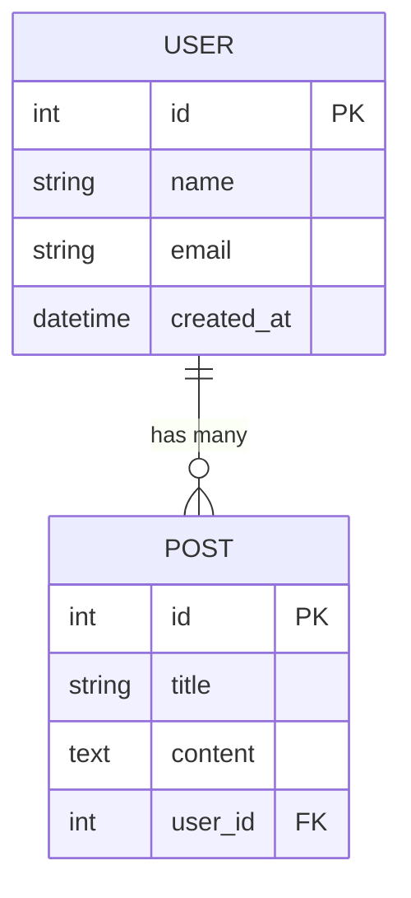

# Lagoon

Generate Mermaid diagrams from Rails models and controllers.

Lagoon is a Ruby gem that generates Mermaid class diagrams and ER diagrams from Rails applications, inspired by [RailRoady](https://github.com/preston/railroady). Unlike RailRoady, which outputs DOT/SVG format and depends on Graphviz, Lagoon outputs Mermaid syntax that can be directly displayed on GitHub, GitLab, Notion, and other platforms that support Mermaid.

## Features

- Generate Mermaid class diagrams from ActiveRecord models
- Generate Mermaid class diagrams from Rails controllers
- Generate Mermaid ER diagrams from database schema
- No external dependencies (no Graphviz required)
- CLI tool and Rake tasks for easy integration
- Configurable output options
- Support for associations, inheritance, and foreign key relationships

## Installation

Add this line to your application's Gemfile:

```ruby
gem 'lagoon'
```

And then execute:

```bash
bundle install
```

Or install it yourself as:

```bash
gem install lagoon
```

## Usage

### Command Line Interface

Lagoon provides a CLI tool for generating diagrams:

```bash
# Generate model class diagram
lagoon models -o doc/models.mermaid

# Generate controller class diagram
lagoon controllers -o doc/controllers.mermaid

# Generate ER diagram
lagoon er -o doc/er_diagram.mermaid

# Generate all diagrams
lagoon all

# Generate compact diagrams (no attributes/methods)
lagoon models -b -i

# Specify diagram direction
lagoon models -d LR  # Left to Right (default: TB - Top to Bottom)

# Show help
lagoon help models
```

### Rake Tasks

In your Rails application, you can use Rake tasks:

```bash
# Generate all diagrams
rake mermaid:all

# Generate specific diagrams
rake mermaid:models
rake mermaid:controllers
rake mermaid:er

# Generate brief diagrams
rake mermaid:brief
```

### Programmatic Usage

You can also use Lagoon programmatically in your Ruby code:

```ruby
require 'lagoon'

# Configure Lagoon
Lagoon.configure do |config|
  config.output_dir = "doc/diagrams"
  config.diagram_direction = "LR"
  config.show_attributes = true
  config.show_methods = false
  config.include_inheritance = true
  config.exclude_models = ["ApplicationRecord"]
end

# Generate diagrams
Lagoon.generate_model_diagram
Lagoon.generate_controller_diagram
Lagoon.generate_er_diagram

# Or generate all at once
Lagoon.generate_all
```

## Configuration Options

You can configure Lagoon globally or per-diagram:

```ruby
Lagoon.configure do |config|
  config.output_dir = "doc/diagrams"          # Default: "doc/diagrams"
  config.diagram_direction = "TB"              # Default: "TB" (Top to Bottom)
                                               # Options: "TB", "BT", "LR", "RL"
  config.show_attributes = true                # Default: true
  config.show_methods = false                  # Default: false
  config.include_inheritance = true            # Default: true
  config.exclude_models = []                   # Default: []
  config.exclude_controllers = []              # Default: []
  config.diagram_format = :class_diagram       # Default: :class_diagram
                                               # Options: :class_diagram, :er_diagram
end
```

## CLI Options

Lagoon CLI supports various options:

### Model Diagrams

- `-b, --brief`: Compact diagram (no attributes/methods)
- `-i, --inheritance`: Include inheritance relationships
- `-e, --exclude`: Exclude specified models
- `-s, --specify`: Only process specified models
- `-a, --all-models`: Include all models
- `--show-belongs-to`: Show belongs_to associations
- `--hide-through`: Hide through associations
- `--all-columns`: Show all columns
- `--hide-magic`: Hide magic fields (id, timestamps)
- `--hide-types`: Hide attribute types

### Controller Diagrams

- `-b, --brief`: Compact diagram (no methods)
- `-i, --inheritance`: Include inheritance relationships
- `-e, --exclude`: Exclude specified controllers
- `-s, --specify`: Only process specified controllers
- `--hide-public`: Hide public methods
- `--hide-protected`: Hide protected methods
- `--hide-private`: Hide private methods

### Common Options

- `-o, --output`: Output file path
- `-d, --direction`: Diagram direction (TB/BT/LR/RL)
- `-r, --root`: Application root path
- `-v, --verbose`: Enable verbose output

## Output Examples

### Model Class Diagram



### ER Diagram



## Requirements

- Ruby >= 3.0.0
- Rails >= 6.0 (for Rails integration)

## Development

After checking out the repo, run `bin/setup` to install dependencies. Then, run `rake spec` to run the tests. You can also run `bin/console` for an interactive prompt that will allow you to experiment.

To install this gem onto your local machine, run `bundle exec rake install`. To release a new version, update the version number in `version.rb`, and then run `bundle exec rake release`, which will create a git tag for the version, push git commits and the created tag, and push the `.gem` file to [rubygems.org](https://rubygems.org).

## Contributing

Bug reports and pull requests are welcome on GitHub at https://github.com/ydah/lagoon.

## License

The gem is available as open source under the terms of the [MIT License](https://opensource.org/licenses/MIT).

## Acknowledgments

Lagoon is inspired by [RailRoady](https://github.com/preston/railroady), which has been a valuable tool for Rails developers for many years.
