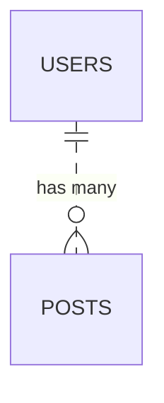
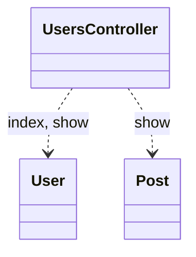

# Lagoon

Lagoon generates deterministic Mermaid diagrams from Rails models, controllers, and database metadata.

## Features

- Active Record model class diagrams with attributes, declared methods, associations, inheritance, STI handling, and polymorphic/through labels
- Controller class diagrams with declared public, protected, and private methods
- ER diagrams based on actual primary keys, foreign keys, unique indexes, nullability, and one-to-one constraints
- Controller-to-model dependency diagrams based on Prism AST analysis
- Application-only discovery by default, with explicit opt-in for engine and gem classes
- Atomic file output and structured results containing content, warnings, and counts
- No external diagram-rendering binary required; Lagoon writes Mermaid source directly

Lagoon depends on the Ruby gems Active Support, Prism, and Thor. A Rails application supplies Active Record and Action Pack.

## Installation

Add Lagoon to your application's Gemfile:

```ruby
gem "lagoon"
```

Then run:

```bash
bundle install
```

## CLI

Run commands from the Rails application root, or pass `--root PATH`:

```bash
lagoon models -o doc/models.mermaid
lagoon controllers -o doc/controllers.mermaid
lagoon er -o doc/er_diagram.mermaid
lagoon controller_models -o doc/controller_models.mermaid
lagoon all -o doc/diagrams
```

For `all`, `--output` is a directory. Lagoon writes `models.mermaid`, `controllers.mermaid`, `er_diagram.mermaid`, and `controller_models.mermaid` inside it.

Useful model options:

```bash
lagoon models --brief
lagoon models --exclude Audit Event --specify User Post
lagoon models --all-models --show-belongs-to --hide-through
lagoon models --hide-magic --hide-types
lagoon models --direction LR --no-inheritance
```

- `--brief` hides attributes and methods.
- `--all-models` includes loaded models outside `app/models`; the default is application models only.
- `--hide-magic` hides `id`, `created_at`, and `updated_at`. They are shown by default.
- `--all-columns` overrides `--hide-magic`.
- `--hide-types` keeps attribute names but omits their types.

Controller and ER filtering use the same `--exclude` and `--specify` contract. `--strict` stops at the first analysis error; otherwise supported per-item failures are returned as warnings and generation continues. Use `--verbose` to print warnings and detailed CLI errors.

Controller commands also accept `--all-controllers` to include loaded controllers outside `app/controllers`.

Direction (`TB`, `BT`, `LR`, or `RL`) is exposed only for class-based diagrams: models, controllers, controller-model dependencies, and `all`.

## Rake tasks

The Railtie provides:

```bash
rake mermaid:all
rake mermaid:models
rake mermaid:controllers
rake mermaid:er
rake mermaid:controller_models
rake mermaid:brief
```

`mermaid:brief` passes the same normalized `brief: true` option used by the CLI.

## Programmatic API

```ruby
require "lagoon"

Lagoon.configure do |config|
  config.output_dir = "doc/diagrams"
  config.diagram_direction = "LR"
  config.show_attributes = true
  config.show_methods = false
  config.include_inheritance = true
  config.exclude_models = ["Audit"]
  config.exclude_controllers = ["HealthController"]
  config.exclude_tables = ["solid_queue_jobs"]
  config.internal_tables = %w[schema_migrations ar_internal_metadata]
  config.helper_models = {
    "current_user" => "User",
    "current_account" => "Account"
  }
  config.strict = false
end

result = Lagoon.generate_model_diagram(
  output: "doc/models.mermaid",
  show_methods: true,
  show_belongs_to: true
)

puts result.path
puts result.content
warn result.warnings.join("\n")
p result.counts
```

Every generator returns `Lagoon::Result` with `path`, `content`, `warnings`, and `counts`. `Result#to_s` and `Result#to_path` return the output path.

Configuration is snapshotted for each generation, so per-call options do not mutate global state. Unknown option keys and invalid directions raise `Lagoon::ConfigurationError`. Use `Lagoon.reset_configuration!` to restore defaults.

`Lagoon.generate_all(output: "doc/diagrams", brief: true)` eager-loads Rails once and returns a hash of four `Lagoon::Result` objects.

### Multiple databases

ER generation discovers the Active Record connection pools. Explicit connections can also be supplied:

```ruby
Lagoon.generate_er_diagram(
  connections: {
    primary: ActiveRecord::Base.connection,
    archive: ArchiveRecord.connection
  }
)
```

When more than one connection is used, entity identifiers are qualified with the connection name.

## Output semantics

ER relationships are oriented from the referenced table to the table containing the foreign key. For a required, non-unique `posts.user_id` foreign key, Lagoon emits:


```mermaid
erDiagram
    USERS ||..o{ POSTS : "has many"
```

The dotted line denotes a non-identifying relationship. A foreign key that is part of the child's primary key is emitted as identifying; nullable and unique foreign keys adjust both cardinalities.

Controller-model output uses UML dependencies rather than ER cardinalities:


```mermaid
classDiagram
    direction TB
    UsersController ..> User : index, show
    UsersController ..> Post : show
```

## Controller-model analysis

Lagoon validates references against loaded `ActiveRecord::Base.descendants` and association reflection. It recognizes:

- direct and namespaced constants, including acronym names
- standalone model constants
- instance and local variables
- block parameters and chained associations
- `before_action` methods
- argument-free controller helper/private method calls
- configurable current-principal helpers such as `current_user`
- inherited actions and source locations outside the conventional controller path

It deliberately ignores arbitrary calls such as `@user.save` and non-model constants such as service objects. Dynamic constantization, metaprogrammed references, and model use hidden behind service objects remain outside static analysis.

## Requirements

- Ruby 3.2 or newer
- Rails 6.1 or newer

CI exercises Ruby 3.2 through 4.0, Rails 6.1 through 8.1, and SQLite/PostgreSQL/MySQL schema integrations.

## Development

```bash
bundle install
bundle exec rake
```

The default task runs RSpec (including a minimal Rails end-to-end fixture), Ruby syntax compilation, RuboCop lint checks, RBS validation, and gem build. Mermaid CLI parsing runs when `MERMAID_CLI` is set, for example:

```bash
MERMAID_CLI=mmdc bundle exec rspec spec/integration/mermaid_syntax_spec.rb
```

## License

Lagoon is available under the [MIT License](LICENSE.txt).
